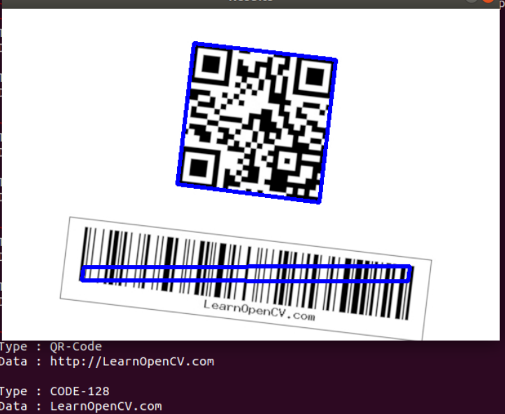
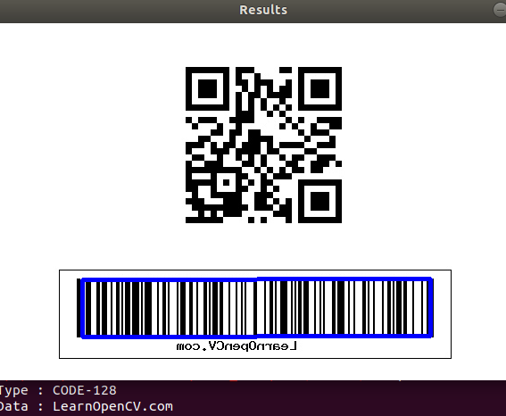
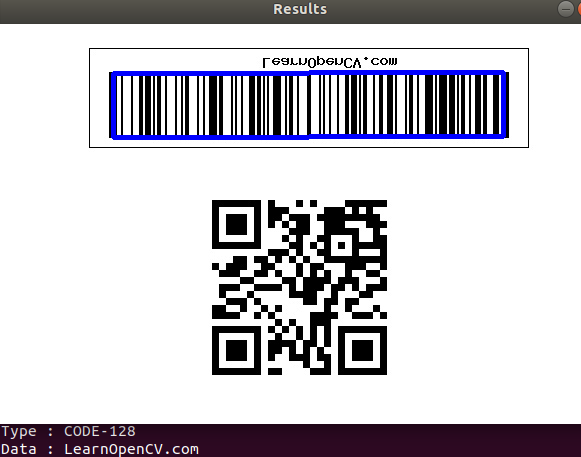
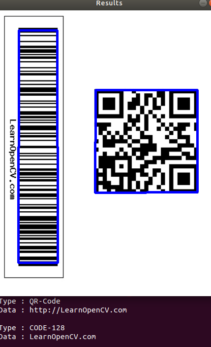
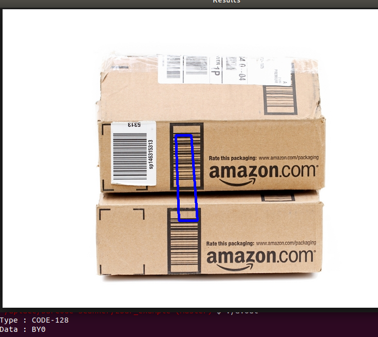

how to compile:
    g++ barcode-QRcodeScanner.cpp `pkg-config --cflags --libs opencv zbar`

where to get zbar documentation
    http://zbar.sourceforge.net/api/
    

Here are some results of a tilted image

Here some results of a backwards image

Here are some results of an upside down image

Didn't find much here

Didn't find anything here

